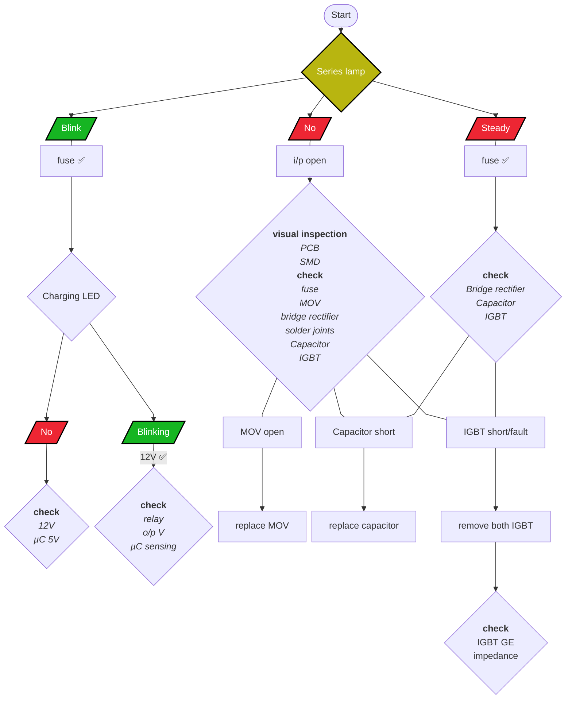

# Charger_repair

```mermaid
   %% Flowchart
   %%{ init: { 'flowchart': { 'curve': 'linear', 'nodeSpacing': 10, 'rankSpacing':'10' } } }%%
   graph TD
   %% Colors %%
   classDef orange fill:#fc822b,stroke:#000,stroke-width:2px,color:#fff
   classDef red fill:#ed2633,stroke:#000,stroke-width:2px,color:#fff
   classDef green fill:#16b522,stroke:#000,stroke-width:2px,color:#fff
   classDef yellow fill:#b8b510,stroke:#000,stroke-width:2px,color:#fff
   A([Start]) --> C{Series lamp}:::yellow
   C --> D[/No/]:::red
   C --> E[/Blink/]:::green
   C --> F[/Steady/]:::red
   D --- A1[i/p open] --> G{"`**visual inspection**
   *PCB*
   *SMD*
   **check**
   *fuse*
   *MOV*
   *bridge rectifier*
   *solder joints*
   *Capacitor*
   *IGBT*`"}
   E --- A2[fuse ✅] --> H{Charging LED}
   F --- A3[fuse ✅] --> I{"`**check**
   *Bridge rectifier*
   *Capacitor*
   *IGBT*`"}
   H --> J[/No/]:::red
   H --> K[/Blinking/]:::green
   J --> L{"`**check**
   *12V*
   *µC 5V*`"}
   K --> |12V ✅| M{"`**check**
   *relay*
   *o/p V*
   *µC sensing*`"}
   G --- B1[MOV open] --> N[replace MOV]
   G --- B2[Capacitor short] --> O[replace capacitor]
   G --- B3[IGBT short/fault] --> P[remove both IGBT]
   I --- B2
   I --- B3
   P --> Q{"`**check**
   IGBT GE
   impedance`"}
```
